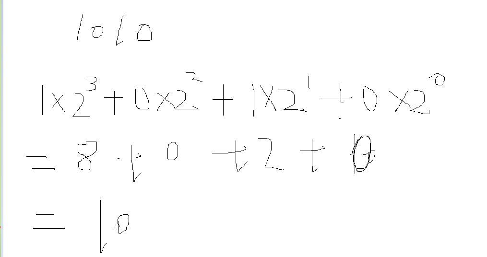
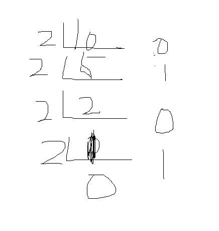
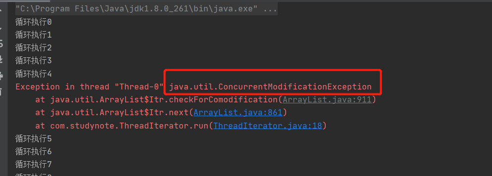
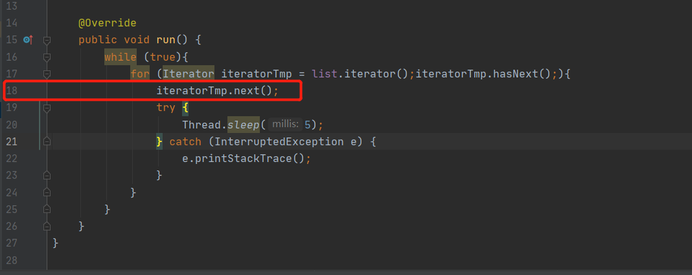
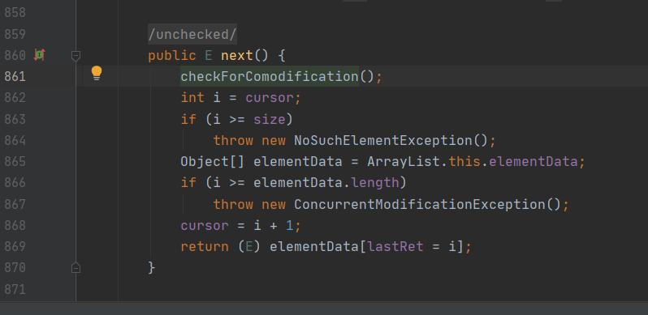
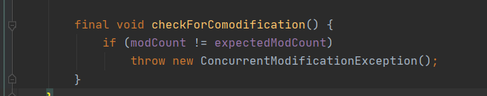

# 数据结构

###### 十进制转二进制



###### 二进制转10进制




\>>表示右移，如果该数为正，则高位补0，若为负数，则高位补1；

\>>>表示无符号右移，也叫逻辑右移，即若该数为正，则高位补0，而若该数为负数，则右移后高位同样补0。


## 数组

> ```
> char[] ch = new char[] {'l','x','y','a','n'};
> System.out.println(ch[5]);
> 
> //会出现 索引越界异常本来就5个，下标最大是4
> Exception in thread "main" java.lang.ArrayIndexOutOfBoundsException: 5
> ```
>
> 特点：
>
> ​	1.内存地址连续，使用之前必须要制定数组长度。
>
> ​	2.可以通过下标访问的方式访问成员，查询效率比较高。
>
> ​	3.增删操作会带来性能消耗。(如果想在一个数组上再加一个数据，那么就得继续扩容：数组的扩容就是重新创建一个下标是5的数组 把原来的拿过来 再在最后面添加上第六个)


## 链表

###### 双向链表

> ```
> LinkedList 源码 中的内部类
> 
> private static class Node<E> {
>         E item; //节点元素
>         Node<E> next;//下一个节点
>         Node<E> prev;//上一个节点
> 
>         Node(Node<E> prev, E element, Node<E> next) {
>             this.item = element;
>             this.next = next;
>             this.prev = prev;
>         }
>     }
> ```
>
> 特点:
>
> ​	1.灵活的空间要求，存储空间不要求连续。
>
> ​	2.不支持下标访问，支持顺序遍历检索。
>
> ​	3.针对增删效果更高一些，只和操作节点的前后节点有关系，无需移动元素。


## 树

###### 红黑树

> 红黑树Red-Black-Tree[RBT] 是一个**自平衡**【不是绝对的】的二叉树。树上的节点需满足如下规则。
>
> 1.每个节点要么是红色，要么是黑色。
>
> 2.根节点必须是黑色。
>
> 3.每个叶子节点【NIL】是黑色。
>
> 4.每个红色节点的两个子节点必须是黑色。
>
> 5.任意节点到每个叶子节点的路劲包含相同数量的黑节点。
>
> 


## 集合

###### Collection 接口：

​				 Collection分为List和Set，List集合中的元素是有序的、可重复的，而Set集合中的元素是无序的、不能重复的。List集合强调的是有序，Set集合强调的是不重复。 

###### Iterator 迭代：

###### Collections：

​				collections Java官方的提供的工具类  

###### Arrays：

​				 主要包含了操纵数组的各种方法 

###### 比较器：

​		Comparable	

```java
Comparable comparable = new Comparable() {
    @Override
    //compareTo方法接受任意类型的参数，来进行比较         
    public int compareTo(Object o) {
                     return 0;
             }
 };
```


  		Comparator


## List接口

### ArrayList 

> 本质就是动态数组,动态扩容

```
	/**
     * Default initial capacity.
     //默认的数组长度
     */
	private static final int DEFAULT_CAPACITY = 10;
	

    /**
     * Shared empty array instance used for empty instances.
     //空数组
     */
    private static final Object[] EMPTY_ELEMENTDATA = {};

    /**
     * Shared empty array instance used for default sized empty instances. We
     * distinguish this from EMPTY_ELEMENTDATA to know how much to inflate when
     * first element is added.
     //集合中存储数据的  数组对象
     */
    private static final Object[] DEFAULTCAPACITY_EMPTY_ELEMENTDATA = {};

    /**
     * The array buffer into which the elements of the ArrayList are stored.
     * The capacity of the ArrayList is the length of this array buffer. Any
     * empty ArrayList with elementData == DEFAULTCAPACITY_EMPTY_ELEMENTDATA
     * will be expanded to DEFAULT_CAPACITY when the first element is added.
     */
    transient Object[] elementData; // non-private to simplify nested class access

    /**
     * The size of the ArrayList (the number of elements it contains).
     *
     * @serial
     //集合中元素的个数
     */
    private int size;
```

#### 初始化操作

> 无参构造
>
> ```
>     public ArrayList() {
>         this.elementData = DEFAULTCAPACITY_EMPTY_ELEMENTDATA;
>     }
> ```
>

##### add添加源码分析

> 第一次添加

```
public boolean add(E e) {
		//确定容量  动态扩容  size初始0 
        ensureCapacityInternal(size + 1);  // ensureCapacityInternal(1);
        //将 要添加的元素添加到数组中   
        elementData[size++] = e;
        return true;
    }
```

```
private void ensureCapacityInternal(int minCapacity) { //1
		//ensureExplicitCapacity(10)
        ensureExplicitCapacity(calculateCapacity(elementData, minCapacity));
 }
 
//elementData {} 为空    mincapacity为1
private static int calculateCapacity(Object[] elementData, int minCapacity) {
        //如果elementdata == {}空
        if (elementData == DEFAULTCAPACITY_EMPTY_ELEMENTDATA) {
        	//DEFAULT_CAPACITY 默认10
        	//返回下面2个参数的最大值
            return Math.max(DEFAULT_CAPACITY, minCapacity);
        }
        //不等于空返回
        return minCapacity;
 }

```

```
private void ensureExplicitCapacity(int minCapacity) { //10
        modCount++; // 自增长

        // 10 - 0
        if (minCapacity - elementData.length > 0)
            grow(minCapacity);
    }
```

```java
private void grow(int minCapacity) { // 10
        // oldCapacity 0
        int oldCapacity = elementData.length; // 0
    	//newCapacity 0
        int newCapacity = oldCapacity + (oldCapacity >> 1);// 向右移动一位
        // 0 - 10 
    	if (newCapacity - minCapacity < 0)
            //newCapacity 10
            newCapacity = minCapacity;
        if (newCapacity - MAX_ARRAY_SIZE > 0)
            newCapacity = hugeCapacity(minCapacity);
        // 返回一个新的长度数组
    	//elementData {} 付给了 newCapacity {,,,,,,,,,}
        elementData = Arrays.copyOf(elementData, newCapacity);
}
```

> 第二次添加

```java
public boolean add(E e) {
        ensureCapacityInternal(size + 1);  // 2
        elementData[size++] = e;
        return true;
}
```

```java
private void ensureCapacityInternal(int minCapacity) { // 2
    	// ensureExplicitCapacity(10,2)
        ensureExplicitCapacity(calculateCapacity(elementData, minCapacity));
}

private static int calculateCapacity(Object[] elementData, int minCapacity) {
    	// 10 == {}
        if (elementData == DEFAULTCAPACITY_EMPTY_ELEMENTDATA) {
            return Math.max(DEFAULT_CAPACITY, minCapacity);
        }
    	//无效返回 2
        return minCapacity;
    }
```

```java
private void ensureExplicitCapacity(int minCapacity) { //2
        modCount++;

        // 2 - 10 不成立 继续往下执行
        if (minCapacity - elementData.length > 0)
            grow(minCapacity);
    }

```

```java
public boolean add(E e) { 
        ensureCapacityInternal(size + 1);  // 2
        elementData[size++] = e; // elementData[2] = e;
        return true;
    }
```

> 第11次添加

```java
public boolean add(E e) {
        ensureCapacityInternal(size + 1);  // 12
        elementData[size++] = e;
        return true;
    }

```

```java
private void ensureCapacityInternal(int minCapacity) { //12
        ensureExplicitCapacity(calculateCapacity(elementData, minCapacity));
    }

//参数是     10 12
private static int calculateCapacity(Object[] elementData, int minCapacity) { 
        if (elementData == DEFAULTCAPACITY_EMPTY_ELEMENTDATA) {
            return Math.max(DEFAULT_CAPACITY, minCapacity);
        }
    	//返回12
        return minCapacity;
    }
```

```java
private void ensureExplicitCapacity(int minCapacity) { //12
        modCount++;

        // 12 - 10  > 0
        if (minCapacity - elementData.length > 0)
            grow(minCapacity);
    }

private void grow(int minCapacity) { //12
        // oldCapacity 10
        int oldCapacity = elementData.length;
        int newCapacity = oldCapacity + (oldCapacity >> 1); // 10 + 5
    	// 15 - 10
        if (newCapacity - minCapacity < 0)
            newCapacity = minCapacity;
    	// MAX_ARRAY_SIZE 是指integer的最大值  这个地方始终都是小于0
        if (newCapacity - MAX_ARRAY_SIZE > 0)
            newCapacity = hugeCapacity(minCapacity);
        //elementData 10 {1,2,3,4,5,6,7,8,9,10}
    	//newCapacity 15 {1,2,3,4,5,6,7,8,9,10,,,,,}
    	//也就是在原来的基础上复制到另一个新的数组中
        elementData = Arrays.copyOf(elementData, newCapacity);
    }

public boolean add(E e) {
        ensureCapacityInternal(size + 1);  // 12
        elementData[size++] = e; elementData[12] = e;
        return true;
    }

```


##### get获取源码分析

```java
public E get(int index) { // 1
    	//检查下标是否合法
        rangeCheck(index);
		
    	//返回指定下标处的数据
        return elementData(index);
    }

private void rangeCheck(int index) {
        if (index >= size) // 下标如果大于 长度
            //就抛出异常索引越界
            throw new IndexOutOfBoundsException(outOfBoundsMsg(index));
    }
```


##### set获取源码分析

```java
// 下标为1     数据 11
public E set(int index, E element) { // 1   11
    //检查下标是否合法 否则抛出索引越界    
    rangeCheck(index);
		//获取到索引处数据
        E oldValue = elementData(index);
    	//把索引处数据进行赋值
        elementData[index] = element;
    	//返回原来的数据
        return oldValue;
    }
```


##### remove获取源码分析(数组长度不变)

```java
public E remove(int index) { // 1
        //检查索引是否合法
    	rangeCheck(index);

        modCount++;
    	//获取到索引处数据
        E oldValue = elementData(index);
		//15 - 1 - 1 = 13
        int numMoved = size - index - 1;
    	//13 > 0
        if (numMoved > 0)
            //源数组{1,2,3,4,5,6,7,8,9}
            //目标数组{1,3,4,5,6,7,8,9,null}
            //这边有一个这样的操作 就是覆盖掉了
            // 源数组  开始下标   目标数组 开始下标  长度
            System.arraycopy(elementData, index+1, elementData, index,
                             numMoved);
        elementData[--size] = null; // 把原来的数组 下标为 14的赋值为null
		//返回删除的数据
        return oldValue;
    }
```


##### FailFast机制

​	快速失败的机制，java集合类为了应对并发访问在集合迭代过程中，内部结构发生变化的一种防护措施，这种错误检查的机制为这种可能发生错误通过抛出java.util.ConcurrentModificationException .

实例：

```java
// 创建2个线程类
public class ThreadIterator extends Thread {

    private List list;

    public ThreadIterator(List list){
        this.list = list;
    }

    @Override
    public void run() {
        while (true){
            for (Iterator iteratorTmp = list.iterator();iteratorTmp.hasNext();){
                iteratorTmp.next();
                try {
                    Thread.sleep(5);
                } catch (InterruptedException e) {
                    e.printStackTrace();
                }
            }
        }
    }
}


public class ThreadAdd extends Thread{

    private List list;

    public ThreadAdd(List list){
        this.list = list;
    }


    @Override
    public void run() {
        for (int i = 0; i < 100 ; i++){
            System.out.println("循环执行"+i);
            try {
                Thread.sleep(5);
                list.add(1);
            } catch (InterruptedException e) {
                e.printStackTrace();
            }
        }

    }
}
```

```java
//测试类
public class JavaTest {

    private static List list = new ArrayList();

    public static void main(String[] args) {
        
        new ThreadIterator(list).start();
        new ThreadAdd(list).start();

    }
}

```









2条线程导致 modCount != expectedModCount 就会报错


> 有参构造
>
> ```
> public ArrayList(int initialCapacity) {
>         if (initialCapacity > 0) {
>         	//出事长度大于0 就创建制定大小的数组
>             this.elementData = new Object[initialCapacity];
>         } else if (initialCapacity == 0) {
>         	//否则就赋值一个空数组
>             this.elementData = EMPTY_ELEMENTDATA;
>         } else {
>         	//否则抛出异常
>             throw new IllegalArgumentException("Illegal Capacity: "+
>                                                initialCapacity);
>         }
>     }
> ```
>


#### LinkedList

LinkedList是通过双向链表去实现的。他的数据结构具有双向链表的优缺点，既然是双向链表，那么他的顺序访问效率会非常高，而且随机访问的效率会比较低，它包含一个非常重要的私有内部静态类：node；

```java
private static class Node<E> {
        E item;//节点的元素
        Node<E> next;//下一个节点
        Node<E> prev;//上一个节点

        Node(Node<E> prev, E element, Node<E> next) {
            this.item = element;
            this.next = next;
            this.prev = prev;
        }
    }
```

```java
public void push(E e) { //push往链表的头部去加
        addFirst(e);
    }

public void addFirst(E e) {
        linkFirst(e);
    }

private void linkFirst(E e) {
        final Node<E> f = first; //头部
        final Node<E> newNode = new Node<>(null, e, f);//把我们的数据e放在头部
        first = newNode;
        if (f == null)
            last = newNode;
        else
            f.prev = newNode;
        size++;
        modCount++;
    }
```

```java
public void add(int index, E element) { //add 从尾部去加
        checkPositionIndex(index);

        if (index == size)
            linkLast(element);
        else
            linkBefore(element, node(index));
    }

void linkLast(E e) {
        final Node<E> l = last;
        final Node<E> newNode = new Node<>(l, e, null);
        last = newNode;
        if (l == null)
            first = newNode;
        else
            l.next = newNode;
        size++;
        modCount++;
    }

```


get方法:本质上还是便利

```java
public E get(int index) {//获取对应下标的值
        checkElementIndex(index);
        return node(index).item;
    }
    
Node<E> node(int index) {
        // assert isElementIndex(index);

        if (index < (size >> 1)) {//如果index < 长度的一般
            Node<E> x = first; //从头开始循环
            for (int i = 0; i < index; i++)
                x = x.next;
            return x;
        } else {
            Node<E> x = last; // 从尾部开始循环
            for (int i = size - 1; i > index; i--)
                x = x.prev;
            return x;
        }
    }
```

set方法：

```java
public E set(int index, E element) {
        checkElementIndex(index);//检查下标是否合法
        Node<E> x = node(index);//根据下标获取node对象
        E oldVal = x.item;//记录原来的值
        x.item = element;//赋予新的值
        return oldVal;//返回修改之前的值
    }
```

#### Vector

和ArrayList很相似，都是以动态数组的形式存储数据。

vector是线程安全的。

每个方法都有加synchronized关键字所修饰。对性能有比较大的影响慢慢就被淘汰了。


Collections

```java
collecitons中的synchronized可以增加代码的灵活度，需要同步的时候就通过下面的代码实现

List list1 = Collections.synchronizedList(list);

```


## set接口

### 1.HashSet

>概述:
>
>​		HashSet 实现set接口，由哈希表支持，他不保证set的迭代顺序，特别是他不保证该顺序永久不变。允许使用null作为元素。
>
>特点:
>
>​		底层数据结构是哈希表，HashSet的本质是一个“没有重复元素的集合”，他是通过`HashMap`实现的HashSet中包含一个HashMap类型的成员变量`map`.

```java
private transient HashMap<E,Object> map; //成员变量map

public HashSet() {//无参构造器
        map = new HashMap<>();
    }

```


add方法：本质上试讲数据保持在HashMap中，key是我们添加的内容，value就是我们定义的一个object对象。

```java
public boolean add(E e) {
        return map.put(e, PRESENT)==null;
    }
```


### 2.TreeSet

> 概述：
>
> ​		基于TreeMap的NavigableSet实现，使用元素的自然顺序进行排序，后者根据创建set时提供的Comparator进行排序，具体取决于使用的构造方法。
>
> 
>
> 本质是将数据保存在TreeMap中，key是我们添加的内容，value是定义的一个object对象。

```java
public TreeSet() {
        this(new TreeMap<E,Object>());
    }
```


## Map 接口：

> Map集合的特点：
>
> ​	1.能够存储唯一的列的数据key(唯一不可重复)set
>
> ​	2.能够存储可以重复的数据(可重复)List
>
> ​	3.值的顺序取决于键的顺序
>
> ​	4.键和值都可以存储null元素

### TreeMap

本质上就是红黑树的实现：

````
1.每个节点要么是红色，要么是黑色。

2.根节点必须是黑色。

3.每个叶子节点【NIL】是黑色。

4.每个红色节点的两个子节点必须是黑色。

5.任意节点到每个叶子节点的路劲包含相同数量的黑节点。
````

```java
private transient Entry<K,V> root;  //根节点就是entry对象


K key;//键
V value;//值
Entry<K,V> left;//左子节点
Entry<K,V> right;//右子节点
Entry<K,V> parent;//父节点
boolean color = BLACK;//节点的颜色  默认黑色
```

map.put:

```java
public V put(K key, V value) {
    	//将root赋值给局部变量  初始为null
        Entry<K,V> t = root;
    	//第一次添加 root为空
        if (t == null) {
            //初始操作
            //检测key是否为空
            compare(key, key); // type (and possibly null) check
			//将要添加的key.value封装成一个entry对象，并赋值给root
            root = new Entry<>(key, value, null);
            size = 1;
            modCount++;
            return null;
        }
        int cmp;
        Entry<K,V> parent;//父节点
        // split comparator and comparable paths
        Comparator<? super K> cpr = comparator;//获得比较器
        if (cpr != null) {
            //一直找到插入节点的父节点
            do {
                //将root赋值给parent
                parent = t;
                //和root节点比较值的大小
                cmp = cpr.compare(key, t.key);
                
                if (cmp < 0)
                    //将父节点的左子节点赋值给t
                    t = t.left;
                else if (cmp > 0)
                    //将父节点的右节点赋值给t
                    t = t.right;
                else
                    //直接和父节点的key相等 修改值
                    return t.setValue(value);
            } while (t != null);
        }
        else {
            //比较器不存在的情况
            
            if (key == null)
                throw new NullPointerException();
            @SuppressWarnings("unchecked")
                Comparable<? super K> k = (Comparable<? super K>) key;
            do {
                parent = t;
                cmp = k.compareTo(t.key);
                if (cmp < 0)
                    t = t.left;
                else if (cmp > 0)
                    t = t.right;
                else
                    return t.setValue(value);
            } while (t != null);
        }//t 就是我们要插入节点的父节点 parent
    
    //将我们要插入的key value 封装成一个entry对象
        Entry<K,V> e = new Entry<>(key, value, parent);
        if (cmp < 0)
            parent.left = e;//插入节点在父节点左侧
        else
            parent.right = e;//插入节点在父节点右侧
        fixAfterInsertion(e);//实现红黑树的平衡
        size++;
        modCount++;
        return null;
    }
```

fixAfterInsertion：实现平衡的方法

```java
private void fixAfterInsertion(Entry<K,V> x) {
    //设置添加节点的颜色为红色
        x.color = RED;
	//循环的条件 x添加的节点不是空  不是root节点   父节点颜色为红色
        while (x != null && x != root && x.parent.color == RED) {
            //父节点 是否 是祖父节点 的左侧节点
            if (parentOf(x) == leftOf(parentOf(parentOf(x)))) {
                //获取父节点的兄弟节点（叔叔节点）
                Entry<K,V> y = rightOf(parentOf(parentOf(x)));
                if (colorOf(y) == RED) { //叔叔节点是红色
                    //变色
                    setColor(parentOf(x), BLACK);//设置父节点为黑色
                    setColor(y, BLACK);//设置叔叔节点的颜色为黑色
                    setColor(parentOf(parentOf(x)), RED);//设置祖父节点的颜色是红色
                    x = parentOf(parentOf(x));//将祖父节点设置为插入的节点
                } else {//叔叔节点是黑色
                    if (x == rightOf(parentOf(x))) {//判断插入节点是否是父节点的右侧节点
                        x = parentOf(x);//将父节点作为插入节点
                        rotateLeft(x);//左旋  进行位置的调整
                    }
                    setColor(parentOf(x), BLACK);//设置父节点为黑色
                    setColor(parentOf(parentOf(x)), RED);//设置祖父节点为红色
                    rotateRight(parentOf(parentOf(x)));//以祖父节点做右旋
                }
            } else {//父节点是祖父节点的右侧子节点
                //获取叔叔节点
                Entry<K,V> y = leftOf(parentOf(parentOf(x)));
                if (colorOf(y) == RED) {//叔叔节点为红色
                    //变色
                    setColor(parentOf(x), BLACK);
                    setColor(y, BLACK);
                    setColor(parentOf(parentOf(x)), RED);
                    x = parentOf(parentOf(x));
                } else {
                    //插入几点在父节点的右侧
                    if (x == leftOf(parentOf(x))) {
                        x = parentOf(x);
                        rotateRight(x);//右旋操作
                    }
                    setColor(parentOf(x), BLACK);
                    setColor(parentOf(parentOf(x)), RED);
                    rotateLeft(parentOf(parentOf(x)));//左旋
                }
            }
        }
    //根节点的颜色为黑色
        root.color = BLACK;
    }
```


​	


### HashMap

> 1.HashMap底层结构
>
> ​		jdk1.7以及以前是采用数组加 链表
>
> ​		jdk1.8之后 采用数组+链表 或者是 数组+红黑树的方式进行元素的存储
>
> 2.保存在hashmap集合中的元素都是将一个map.entry内部接口的实现

```java
	//默认的hashmap中数组的长度默认是16
    static final int DEFAULT_INITIAL_CAPACITY = 1 << 4; // aka 16

    //hashmap中数组的最大容量
    static final int MAXIMUM_CAPACITY = 1 << 30;

   //默认的扩容平衡因子
    static final float DEFAULT_LOAD_FACTOR = 0.75f;

    //链表转红黑树的临界值
    static final int TREEIFY_THRESHOLD = 8;

    //红黑树转链表的临界值
    static final int UNTREEIFY_THRESHOLD = 6;

    //链表转红黑树的数组长度 的临界值
    static final int MIN_TREEIFY_CAPACITY = 64;


	//hashmap中的数组结构
	transient Node<K,V>[] table;

   //
    transient Set<Map.Entry<K,V>> entrySet;

   //hashmap中的元素个数
    transient int size;

    //对hashmap的操作次数
    transient int modCount;

   //扩容的临界值
    int threshold;

   //实际的扩容值
    final float loadFactor;
```


```java
public V put(K key, V value) {
        return putVal(hash(key), key, value, false, true);
    }

//hash(key)  获取key对应的哈希值
static final int hash(Object key) {
        int h;
        return (key == null) ? 0 : (h = key.hashCode()) ^ (h >>> 16);//为什么要右移16位
    }


final V putVal(int hash, K key, V value, boolean onlyIfAbsent,
                   boolean evict) {
        Node<K,V>[] tab; Node<K,V> p; int n, i;
    	//初始判断
        if ((tab = table) == null || (n = tab.length) == 0)
            //resize()第一次 初始数组    n 数组的长度  初始的时候获取 了一个容量为16的数组
            n = (tab = resize()).length;
    	//确定插入的key在数组中的下标
        if ((p = tab[i = (n - 1) & hash]) == null)
            tab[i] = newNode(hash, key, value, null);
        else {
            Node<K,V> e; K k;
            if (p.hash == hash &&
                ((k = p.key) == key || (key != null && key.equals(k))))
                e = p;
            else if (p instanceof TreeNode)
                //表示数组中存放的节点是一个红黑树节点
                e = ((TreeNode<K,V>)p).putTreeVal(this, tab, hash, key, value);
            else {
                for (int binCount = 0; ; ++binCount) {
                    //p.next 就是下一个节点
                    if ((e = p.next) == null) {
                        //将新的节点添加到了链表的尾部
                        p.next = newNode(hash, key, value, null);					
                         //判断是否满足 链表转红黑树的 条件(链表长度 等于8 链表转红黑树)
                        if (binCount >= TREEIFY_THRESHOLD - 1) 
                            //转红黑树
                            treeifyBin(tab, hash);
                        break;
                    }
                    if (e.hash == hash &&
                        ((k = e.key) == key || (key != null && key.equals(k))))
                        break;
                    p = e;
                }
            }
            if (e != null) { // existing mapping for key
                V oldValue = e.value;
                if (!onlyIfAbsent || oldValue == null)
                    e.value = value;
                afterNodeAccess(e);
                return oldValue;
            }
        }
        ++modCount;
        if (++size > threshold)
            resize();
        afterNodeInsertion(evict);
        return null;
    }


//转红黑树
final void treeifyBin(Node<K,V>[] tab, int hash) {
        int n, index; Node<K,V> e;
    	//如果tab为空  或者 数组的长度小于 64 
        if (tab == null || (n = tab.length) < MIN_TREEIFY_CAPACITY)
            //就扩容
            resize();
    	//否则 
        else if ((e = tab[index = (n - 1) & hash]) != null) {
            //链表转红黑树的逻辑
            TreeNode<K,V> hd = null, tl = null;
            do {
                TreeNode<K,V> p = replacementTreeNode(e, null);
                if (tl == null)
                    hd = p;
                else {
                    p.prev = tl;
                    tl.next = p;
                }
                tl = p;
            } while ((e = e.next) != null);
            if ((tab[index] = hd) != null)
                hd.treeify(tab);
        }
    }
```


第一次resize()

```java
final Node<K,V>[] resize() {
        Node<K,V>[] oldTab = table;
        int oldCap = (oldTab == null) ? 0 : oldTab.length;
        int oldThr = threshold;
        int newCap, newThr = 0;
        if (oldCap > 0) {
            if (oldCap >= MAXIMUM_CAPACITY) {
                threshold = Integer.MAX_VALUE;
                return oldTab;
            }
            else if ((newCap = oldCap << 1) < MAXIMUM_CAPACITY &&
                     oldCap >= DEFAULT_INITIAL_CAPACITY)
                newThr = oldThr << 1; // double threshold
        }
        else if (oldThr > 0) // initial capacity was placed in threshold
            newCap = oldThr;
        else {               // zero initial threshold signifies using defaults
            newCap = DEFAULT_INITIAL_CAPACITY;
            newThr = (int)(DEFAULT_LOAD_FACTOR * DEFAULT_INITIAL_CAPACITY);
        }
        if (newThr == 0) {
            float ft = (float)newCap * loadFactor;
            newThr = (newCap < MAXIMUM_CAPACITY && ft < (float)MAXIMUM_CAPACITY ?
                      (int)ft : Integer.MAX_VALUE);
        }
        threshold = newThr;
        @SuppressWarnings({"rawtypes","unchecked"})
        Node<K,V>[] newTab = (Node<K,V>[])new Node[newCap];
        table = newTab;
        if (oldTab != null) {
            for (int j = 0; j < oldCap; ++j) {
                Node<K,V> e;
                if ((e = oldTab[j]) != null) {
                    oldTab[j] = null;
                    if (e.next == null)
                        newTab[e.hash & (newCap - 1)] = e;
                    else if (e instanceof TreeNode)
                        ((TreeNode<K,V>)e).split(this, newTab, j, oldCap);
                    else { // preserve order
                        Node<K,V> loHead = null, loTail = null;
                        Node<K,V> hiHead = null, hiTail = null;
                        Node<K,V> next;
                        do {
                            next = e.next;
                            if ((e.hash & oldCap) == 0) {
                                if (loTail == null)
                                    loHead = e;
                                else
                                    loTail.next = e;
                                loTail = e;
                            }
                            else {
                                if (hiTail == null)
                                    hiHead = e;
                                else
                                    hiTail.next = e;
                                hiTail = e;
                            }
                        } while ((e = next) != null);
                        if (loTail != null) {
                            loTail.next = null;
                            newTab[j] = loHead;
                        }
                        if (hiTail != null) {
                            hiTail.next = null;
                            newTab[j + oldCap] = hiHead;
                        }
                    }
                }
            }
        }
        return newTab;
    }
```


动态扩容

```java
final Node<K,V>[] resize() {
        Node<K,V>[] oldTab = table;
        int oldCap = (oldTab == null) ? 0 : oldTab.length;
        int oldThr = threshold;
        int newCap, newThr = 0;
        if (oldCap > 0) {
            if (oldCap >= MAXIMUM_CAPACITY) {
                threshold = Integer.MAX_VALUE;
                return oldTab;
            }
            else if ((newCap = oldCap << 1) < MAXIMUM_CAPACITY &&
                     oldCap >= DEFAULT_INITIAL_CAPACITY)
                //扩容 的临界值
                newThr = oldThr << 1; // double threshold
        }
        else if (oldThr > 0) // initial capacity was placed in threshold
            newCap = oldThr;
        else {               // zero initial threshold signifies using defaults
            newCap = DEFAULT_INITIAL_CAPACITY;
            newThr = (int)(DEFAULT_LOAD_FACTOR * DEFAULT_INITIAL_CAPACITY);
        }
        if (newThr == 0) {
            float ft = (float)newCap * loadFactor;
            newThr = (newCap < MAXIMUM_CAPACITY && ft < (float)MAXIMUM_CAPACITY ?
                      (int)ft : Integer.MAX_VALUE);
        }
        threshold = newThr;
        @SuppressWarnings({"rawtypes","unchecked"})
    //创建数组的长度是32    
    Node<K,V>[] newTab = (Node<K,V>[])new Node[newCap];
        table = newTab;
        if (oldTab != null) {//初始的时候 是不需要复制的
            for (int j = 0; j < oldCap; ++j) {
                Node<K,V> e;
                if ((e = oldTab[j]) != null) {
                    oldTab[j] = null;
                    if (e.next == null)
                        newTab[e.hash & (newCap - 1)] = e;
                    else if (e instanceof TreeNode)
                        //移动红黑树的节点
                        ((TreeNode<K,V>)e).split(this, newTab, j, oldCap);
                    else { // preserve order
                        //普通链表的移动
                        Node<K,V> loHead = null, loTail = null;
                        Node<K,V> hiHead = null, hiTail = null;
                        Node<K,V> next;
                        do {
                            next = e.next;
                            if ((e.hash & oldCap) == 0) {
                                if (loTail == null)
                                    loHead = e;
                                else
                                    loTail.next = e;
                                loTail = e;
                            }
                            else {
                                if (hiTail == null)
                                    hiHead = e;
                                else
                                    hiTail.next = e;
                                hiTail = e;
                            }
                        } while ((e = next) != null);
                        if (loTail != null) {
                            loTail.next = null;
                            newTab[j] = loHead;
                        }
                        if (hiTail != null) {
                            hiTail.next = null;
                            newTab[j + oldCap] = hiHead;
                        }
                    }
                }
            }
        }
        return newTab;
    }
```


## 


