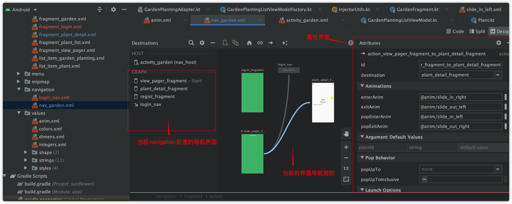
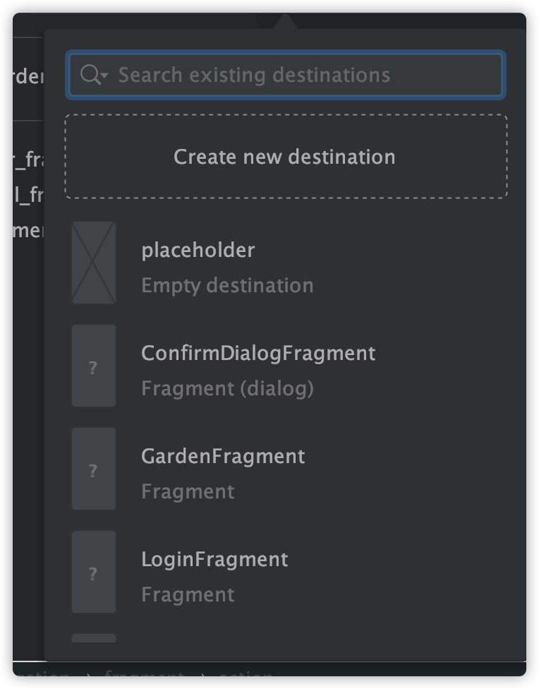

## 导航组件（navigation）的使用

[NavigationGoogle官方文档](https://developer.android.com/guide/navigation)


### 导航组件未出来之前状态

在导航组件未出来之前，一个**app**是由众多**Activity**组成 通过Activity的切换来实现界面的跳转，但是Activity的跳转为AMS负责，
跨进程通信会造成资源消耗。
如果多个界面要进行数据共享 如共享变量，共享service 这将变的非常难做！
虽然也可以通过Fragment来解决 但是多个Fragment的回退栈处理是非常麻烦的事

### 导航组件可以做什么

- 支持多个Fragment的切换
- 导航组件来处理回退栈 应用不需要担心多个Fragment的返回处理
- 导航可以为两个页面的之间的跳转做好Action 参数传递 跳转动画 
- [Safe Args](https://developer.android.com/guide/navigation/navigation-pass-data#Safe-args) Fragment切换中提供安全类型的Gradle插件
- 实现和处理深层链接（intent filter ）
- 包括导航界面模式（例如抽屉式导航栏和底部导航），用户只需完成极少的额外工作

### 导航组件说明

#### 导航图（res/navigation）

导航图可以直观的显示默认界面 以及多个界面之前的跳转关系

#### NavHost

负责加载Fragment

#### NavController

加载导航图的空白容器 实现为NavHostFragment 负责Fragment的跳转 回退

### 导航组件使用

```groovy
//生成安全类型的参数获取 以及跳转支持
 navigationVersion = '2.2.0'
 //project的build.gradle 可选
  classpath "androidx.navigation:navigation-safe-args-gradle-plugin:$navigationVersion"
  
  //app.build
  //安全类型插件 可选 如需要生成java类  替换为androidx.navigation.safeargs
  apply plugin: 'androidx.navigation.safeargs.kotlin'  
  //倒入依赖

   implementation "androidx.navigation:navigation-fragment-ktx:$rootProject.navigationVersion"
   implementation "androidx.navigation:navigation-ui-ktx:$rootProject.navigationVersion"

```

#### 1.创建导航图

> 点击res文件 右键**NEW** **AndroidResourceFile**
>
> ResourceType 选择**Navgation**
>
> 输入名字创建

此时 导航图内会包含**navigation**标签 此标签为导航图的根标签



上方的绿色按钮点击添加Activity/Fragment 或者占位图



导航图的连线为可以跳转到的目标导航界面

生成的代码

```xml
<navigation xmlns:android="http://schemas.android.com/apk/res/android"
    xmlns:app="http://schemas.android.com/apk/res-auto"
    xmlns:tools="http://schemas.android.com/tools"
    app:startDestination="@id/view_pager_fragment">

    <fragment
        android:id="@+id/view_pager_fragment"
        android:name="com.google.samples.apps.sunflower.HomeViewPagerFragment"
        tools:layout="@layout/fragment_view_pager">

        <action
                android:id="@+id/action_view_pager_fragment_to_plant_detail_fragment"
                app:destination="@id/plant_detail_fragment"
                app:enterAnim="@anim/slide_in_right"
                app:exitAnim="@anim/slide_out_left"
                app:popEnterAnim="@anim/slide_in_left"
                app:popExitAnim="@anim/slide_out_right" />
        <action
            android:id="@+id/action_view_pager_fragment_to_login_nav2"
            app:destination="@id/login_nav" />

    </fragment>

    <fragment
        android:id="@+id/plant_detail_fragment"
        android:name="com.google.samples.apps.sunflower.PlantDetailFragment"
        android:label="@string/plant_details_title"
        tools:layout="@layout/fragment_plant_detail">
        <argument
            android:name="plantId"
            app:argType="string" />
    </fragment>
    <fragment tools:layout="@layout/fragment_login"
         android:id="@+id/regist_fragment"
        android:name="com.google.samples.apps.sunflower.RegistFragment"/>


</navigation>
```

- startDestination 为起始目的起

- fragment标签为添加的fragment id为跳转到当前fragment使用的id name为当前Fragment所指向的类 lable为名字 可以省略

- layout为在导航图内预览的布局

- action 为跳转逻辑 destination为要跳转到的目的地

- argument为当前fragmet所需要的传值参数

  

#### 在Activity加载导航图

```xml
  <androidx.fragment.app.FragmentContainerView
            android:id="@+id/nav_host"
            android:name="androidx.navigation.fragment.NavHostFragment" //默认的navHost
            android:layout_width="match_parent"
            android:layout_height="match_parent"
            app:defaultNavHost="true" //是否是默认的 一个activity可以有多个导航图 默认的会处理返回建
            app:navGraph="@navigation/nav_garden"/> // 加载导航图
```

#### 跳转到Fragment

```kotlin
 findNavController().navigate(ArticleFragmentDirections.actionArticleFragmentToDetailsFragment(data.link))
```

上诉操作为跳转到DetailsFragment界面 并且传递了一个String字符串

api

```
Kotlin：

Fragment.findNavController()
View.findNavController()
Activity.findNavController(viewId: Int)

Java：
NavHostFragment.findNavController(Fragment)
Navigation.findNavController(Activity, @IdRes int viewId)
Navigation.findNavController(View)
```

- 在kotlin中内置了Kotlin的扩展函数 可以直接获取到NavController
- 在Java中需要调用Navigation.findNavController 来获取NavController

跳转api

```java
 public void navigate(@NonNull NavDirections directions)
 public void navigate(@NonNull NavDirections directions, @Nullable NavOptions navOptions)
 public void navigate(@NonNull NavDirections directions,
            @NonNull Navigator.Extras navigatorExtras)
 public void navigate(@NonNull Uri deepLink, @Nullable NavOptions navOptions,
            @Nullable Navigator.Extras navigatorExtras)
 public void navigate(@NonNull Uri deepLink, @Nullable NavOptions navOptions)
 public void navigate(@NonNull Uri deepLink)
 public void navigate(@IdRes int resId, @Nullable Bundle args, @Nullable NavOptions navOptions,
            @Nullable Navigator.Extras navigatorExtras)
            
 public void navigate(@IdRes int resId, @Nullable Bundle args,
            @Nullable NavOptions navOptions)
 public void navigate(@IdRes int resId, @Nullable Bundle args)
 
 public void navigate(@IdRes int resId)
```

上述为导航到目的地的api


##### 在Fragment获取传递的值（Kotlin）

```kotlin
class DetailsFragment:BaseFragment() {
    private val args by navArgs<DetailsFragmentArgs>()
}
```

- DetailsFragmentArgs为Gradle自动生成的类
- 生成规则为[类名]Args

